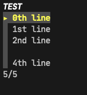
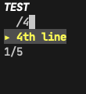

# MenuScreen
> A simple go lib based on `github.com/gdamore/tcell/v2`,which helps you build a simple menu UI in your terminal.

## Install
`go get -u github.com/SCU-SJL/menuscreen`

## Usage
demo is `see ./test/test.go`.  
when the screen started, you can press `/` to search and  press `enter` to confirm.

## Demo

